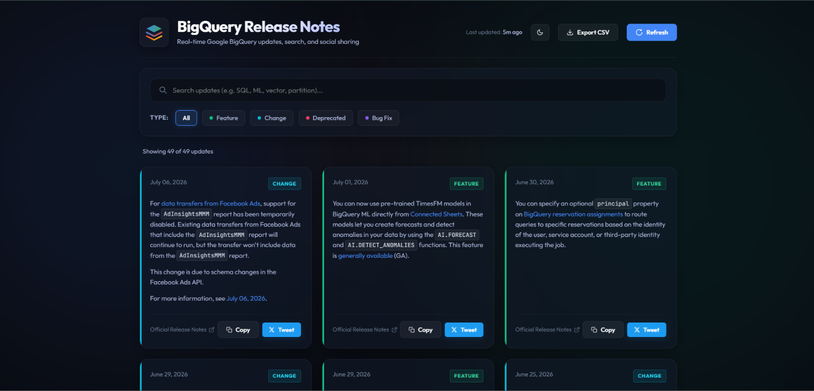

# BigQuery Release Notes Explorer

[](https://www.python.org/)
[](https://flask.palletsprojects.com/)
[](https://opensource.org/licenses/MIT)

A modern, high-performance web dashboard that fetches, parses, searches, filters, and shares Google BigQuery release notes. Built using a **Python Flask** backend and a responsive **Vanilla HTML5, JavaScript, and CSS3** frontend.

---

## 🌟 Key Features

*   **Atomic Note Splitting:** Automatically parses Google Cloud's consolidated XML Atom feed and splits updates by heading type (`Feature`, `Change`, `Deprecated`, `Bug Fix`), converting them into individual, shareable cards.
*   **Real-time Searching:** Instant character matching across release dates, titles, and text contents.
*   **Multi-Category Filtering:** Clean glassmorphic category selection pills with colored neon left borders mapping to specific update severity types.
*   **Interactive Tweet Composer Modal:**
    *   Generates pre-formatted tweet drafts containing standard headers, links, and tags within the 280-character limit.
    *   Tracks character limits in real-time and warns users visually if modifications exceed X (Twitter) constraints.
    *   Interactive hashtag selector pills that seamlessly append or remove tags in the composer area.
*   **Resilient In-Memory Caching:** Caches retrieved updates locally for 10 minutes to minimize external calls and load times, with automatic grace-falls to cache if Google's feed is temporarily unreachable.
*   **Artificial Spinner Latency:** Guarantees a minimum 800ms animation buffer on forced syncs to ensure loading transitions remain visually satisfying and smooth.

---

## 🛠️ Tech Stack

Backend
- Python
- Flask
- Requests
- BeautifulSoup4
- ElementTree

Frontend
- HTML5
- CSS3
- Vanilla JavaScript (ES6)

Developer Tools
- Git
- GitHub
- VS Code
- Google Antigravity (AI-assisted development)

Integrations
- Google BigQuery Release Notes XML Feed
- Twitter Web Intent API

---

## 📂 Project Structure

```
bq-releases-notes/
├── app.py                  # Flask server application & XML-to-JSON parsing engine
├── requirements.txt        # Python dependency manifest
├── .gitignore              # Configured Git tracking exclusion patterns
├── README.md               # User manual and project description
├── templates/
│   └── index.html          # Semantic HTML SPA layout & Composer modal structures
└── static/
    ├── css/
    │   └── style.css       # Visual layout, neon themes, blurred backgrounds & animations
    └── js/
        └── app.js          # DOM manipulation, REST client, and Tweet composer controller
```

---

## 🚀 Getting Started

Follow these instructions to run the application locally on your machine.

### Prerequisites
*   Python 3.8 or higher installed on your system.

### 1. Set Up Environment
Create and activate a virtual environment to manage dependencies locally:
```bash
# Initialize virtual environment
python -m venv venv

# Activate on Windows:
venv\Scripts\activate

# Activate on macOS/Linux:
source venv/bin/activate
```

### 2. Install Packages
Install the required packages using pip:
```bash
pip install -r requirements.txt
```

### 3. Run the Web Server
Launch the Flask development server:
```bash
python app.py
```

Open your browser and navigate to **`http://127.0.0.1:5000`** to view the application.

---

---


## Screenshot



---

## ⚙️ How it Works

### 1. Backend Processing (`app.py`)
1.  **Request:** The application pulls down the Google BigQuery Atom feed XML.
2.  **Atom Parsing:** Parses entry metadata (like title date and link anchors) using Python's `ElementTree`.
3.  **BeautifulSoup Segmenting:** Splice the raw HTML code by locating `<h3>` tags. It gathers all sibling tags (`<p>`, `<ul>`, `<code>`) under each header, dividing a single day's updates into separate, categorized objects.
4.  **Hashing:** Assigns a unique MD5 hash string based on the entry parameters to serve as a card ID.

### 2. Client Rendering (`app.js` & `style.css`)
1.  **Dynamic Rendering:** Grabs updates from `/api/release-notes` and injects them as grid cards.
2.  **Neon UI Coding:** Applies colored neon borders and custom badges dynamically according to the category:
    *   🟢 **Feature:** Green (`#10b981`)
    *   🔵 **Change:** Cyan (`#06b6d4`)
    *   🔴 **Deprecated:** Red (`#f43f5e`)
    *   🟣 **Bug Fix:** Purple (`#8b5cf6`)
3.  **Tweet Intent Mapping:** Translates card data into standard layouts. When users click **Tweet**, it opens the custom compositor modal, computes character balances in real-time, and opens a new window directed to the Twitter intent system for secure posting.

---

---

# What I Learned

Building this project helped me understand much more than just creating a Flask application. It gave me hands-on experience with AI-assisted software engineering and modern full-stack development workflows.

### AI-Assisted Development
- Used natural language prompts to iteratively build and improve the application.
- Learned how AI coding agents can assist with architecture decisions, feature implementation, debugging, and documentation.
- Experienced an agent-driven development workflow using Google's Antigravity tooling.

### Backend Engineering
- Designing REST APIs with Flask.
- Parsing and processing XML feeds efficiently.
- Working with external APIs and handling unreliable network responses.
- Implementing in-memory caching to improve performance and reduce unnecessary requests.

### Frontend Development
- Building responsive interfaces using Vanilla HTML, CSS, and JavaScript.
- Managing dynamic DOM updates without frontend frameworks.
- Creating reusable UI components and interactive user experiences.

### Data Processing
- Parsing XML using ElementTree.
- Extracting structured information from HTML using BeautifulSoup.
- Transforming semi-structured data into searchable JSON objects.
- Categorizing release notes automatically based on heading types.

### Software Engineering
- Structuring projects using a clean separation of backend, frontend, and static assets.
- Writing maintainable code with modular architecture.
- Using Git and GitHub for version control.
- Creating professional project documentation.

### Performance Optimization
- Local caching strategy.
- Efficient client-side searching and filtering.
- Reduced API calls through cache reuse.
- Smooth loading states and UI feedback.

---

# Future Improvements

This project can be extended into a much more intelligent AI-powered developer assistant.

### AI Features
- Integrate Gemini API to generate concise summaries for each release note.
- Add an AI chatbot that answers questions about BigQuery updates.
- Allow users to ask natural language questions such as:
  - *"What changed in BigQuery this month?"*
  - *"Show all storage-related updates."*
  - *"Summarize breaking changes."*

### Semantic Search
- Replace keyword search with vector embeddings.
- Enable semantic search using embedding models.
- Find relevant updates based on meaning instead of exact keywords.

### RAG (Retrieval-Augmented Generation)
- Convert release notes into embeddings.
- Store embeddings in a vector database.
- Retrieve relevant updates before generating AI responses.

### Personalized Notifications
- Email notifications for selected categories.
- Weekly AI-generated summaries.
- User-specific alert preferences.

### Analytics Dashboard
- Release trend visualization.
- Feature frequency over time.
- Category distribution charts.
- Timeline of major BigQuery releases.

### Deployment
- Deploy on Google Cloud Run.
- Dockerize the application.
- Add GitHub Actions for CI/CD.
- Automatic deployment on every push.

### Authentication
- Google OAuth login.
- Save user preferences.
- Bookmark important release notes.
- Personalized dashboard.

### Scalability
- Replace in-memory cache with Redis.
- Add background refresh jobs.
- Database support for historical release notes.
- Rate limiting and monitoring.

---

# Skills Demonstrated

- Python
- Flask
- REST API Development
- XML Parsing
- BeautifulSoup
- JavaScript (ES6)
- HTML5
- CSS3
- API Integration
- Caching Strategies
- Git & GitHub
- AI-Assisted Development
- Prompt Engineering
- Software Architecture
- Responsive UI Design

---

# Possible AI/ML Extensions

This project can evolve into a production-grade AI application by incorporating modern LLM capabilities.

Examples include:

- AI-powered release note summarization
- Retrieval-Augmented Generation (RAG)
- Embedding-based semantic search
- Intelligent recommendation system
- Agentic workflows using Google ADK
- MCP integration for external documentation
- Automated social media content generation
- Conversational interface powered by Gemini

---

# Acknowledgements

This project was built as part of Google's **5-Day AI Agents Intensive Vibe Coding Program** on Kaggle.

Special thanks to Google for introducing modern AI-assisted software engineering workflows using tools such as Antigravity and the Agent Development Kit (ADK).

---
